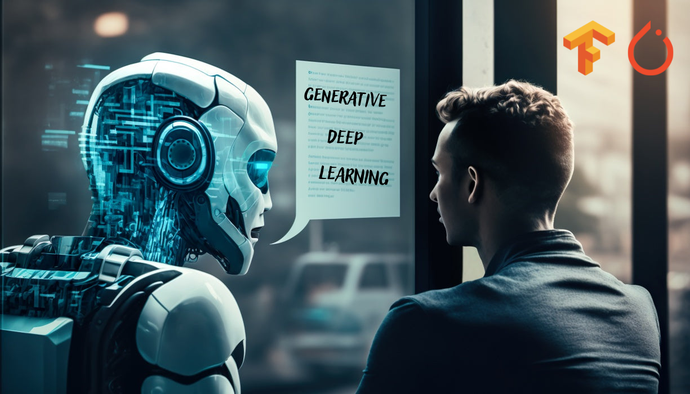

# <h1 align="center">**Generative Deep Learning Models**</h1>

 

This repository contains a collection of links to my repositories, which showcase implementations of generative deep learning models in Python, using the Tensorflow and Pytorch libraries.

## **What is Generative Deep Learning?**

Generative Deep Learning is a subfield of Artificial Intelligence that uses neural networks to generate new data that resemble the training data. These models can generate a variety of data, including images, sounds, text, and more.

## **Implemented Models**

The following are the generative deep learning models that I have implemented to date:

1. [**Autoencoder**](https://github.com/JersonGB22/Autoencoder-TensorFlow): An autoencoder is a neural network that is trained to copy its input to its output. It is used to learn efficient representations of the input data and/or to reduce the dimension of the input data. 

2. [**Conditional GAN**](https://github.com/JersonGB22/CondicionalGAN-TensorFlow-PyTorch): An extension of GANs that allows generating data conditioned on certain information. 

3. [**CycleGAN**](https://github.com/JersonGB22/CycleGAN-TensorFlow-PyTorch): A model for translating images from one domain to another, without the need for paired data. 

4. [**DCGAN (Deep Convolutional Generative Adversarial Networks)**](https://github.com/JersonGB22/DCGAN-TensorFlow-PyTorch): A variant of GANs that uses convolutional layers in its networks. 

5. [**GAN (Generative Adversarial Networks)**](https://github.com/JersonGB22/GAN-TensorFlow-PyTorch): GANs are a type of generative model that uses two neural networks, a generator and a discriminator, which are trained simultaneously. 

6. [**GAN Controllable Generation**](https://github.com/JersonGB22/GANControllableGeneration-TensorFlow-PyTorch): A model that allows controlling the characteristics of the generated data. 

7. [**Neural Style Transfer**](https://github.com/JersonGB22/NeuralStyleTransfer-TensorFlow): A model that applies the style of one image to another. 

8. [**Pix2Pix**](https://github.com/JersonGB22/Pix2Pix-TensorFlow-PyTorch): A model for translating images from one domain to another. 

9. [**VAE (Variational Autoencoder)**](https://github.com/JersonGB22/VAE-TensorFlow): A type of autoencoder that produces a distribution of the input data rather than a single representation. 

## **Contributions**

Contributions to this repository are welcome. If you have any questions or suggestions, please do not hesitate to contact me.

## **Technological Stack**
 

## **Contact**

